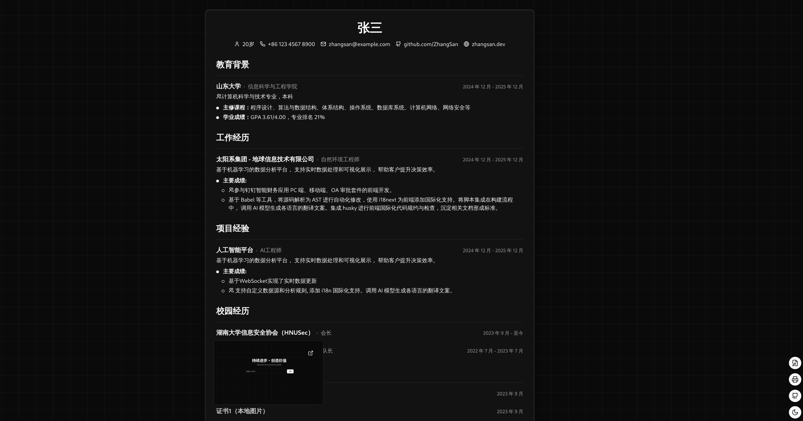
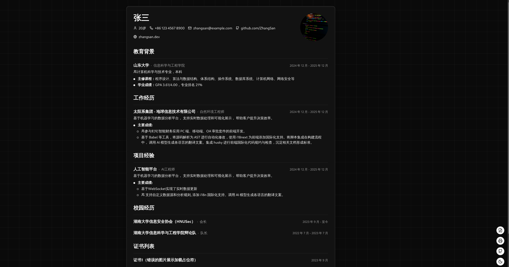
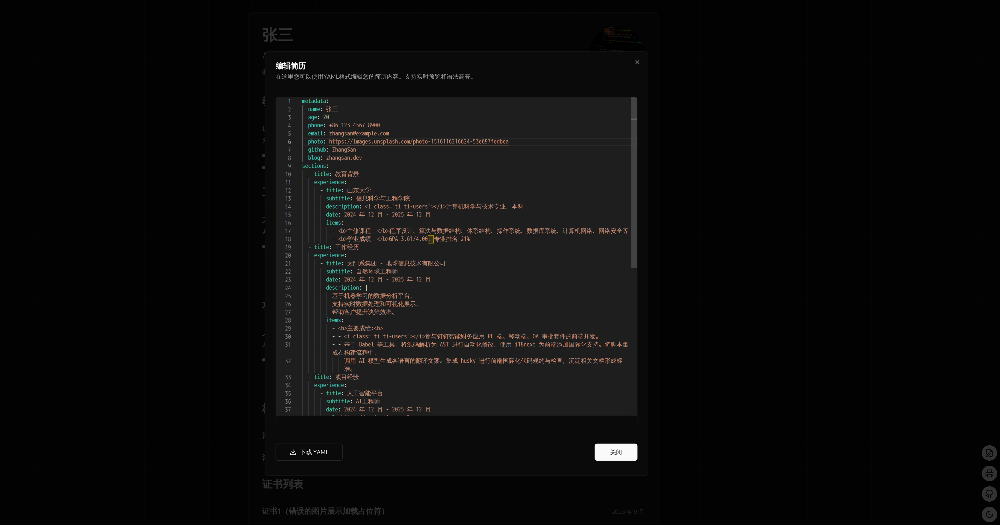

# NextResume 🎉

A modern online resume generator built with Next.js and Tailwind CSS.

<p align="center">
<br>
<a href="https://resume.cloudnative.love/">🖥 Online Preview（access code is public）</a>
<br><br> 
<a href="https://vercel.com/new/clone?repository-url=https://github.com/SJFCS/Next-Resume/tree/main&project-name=Next-Resume&repo-name=Next-Resume" rel="nofollow"></a>
<a href="https://app.netlify.com/start/deploy?repository=https://github.com/SJFCS/Next-Resume" rel="nofollow"></a>
<a href="https://stackblitz.com/github/SJFCS/Next-Resume" rel="nofollow"></a>
</p>

<p align="center">
  
  
  
  

</p>

## Features

- 🎨 Support light/dark/system theme
- 📱 Mobile friendly
- 🔒 Support access code protection
- 📝 Support HTML tags in descriptions and list items
- 🖼️ Support image preview

- **Theme Switching**

  - Automatic light/dark mode switching
  - Smooth transition animation

- **Responsive Design**

  - Perfectly adapted for mobile and desktop
  - Smart layout adjustment
  - Optimized interaction for touch devices

- **Environment Variables**

  - Inject sensitive information using environment variables
  - Secure and easy to manage

- **Image Preview**

  - Supports project image display
  - Elegant hover preview

- **Resume Customization**

  - Use YAML to configure resume content
  - Flexible layout organization

- **Ready to Use**
  - Simple configuration
  - Clear project structure
  - Complete type hints

## Quick Start

To use NextResume, you need to edit the `next-resume.yaml`,`next-resume.config` to configure your resume content.

## Local Development

```bash
npm i

npm run dev
```

This command starts a local development server and opens up a browser window. Most changes are reflected live without having to restart the server.

## Build

```bash
npm run build
npm run serve
```

This command generates static content into the build directory and can be served using any static contents hosting service.

# Export PDF

https://chromewebstore.google.com/detail/web-to-pdf-%E7%BD%91%E9%A1%B5%E8%BD%ACpdf/pamnlaoeobcmhkliljfaofekeddpmfoh

```
hideButtons: true # 隐藏界面按钮
```
